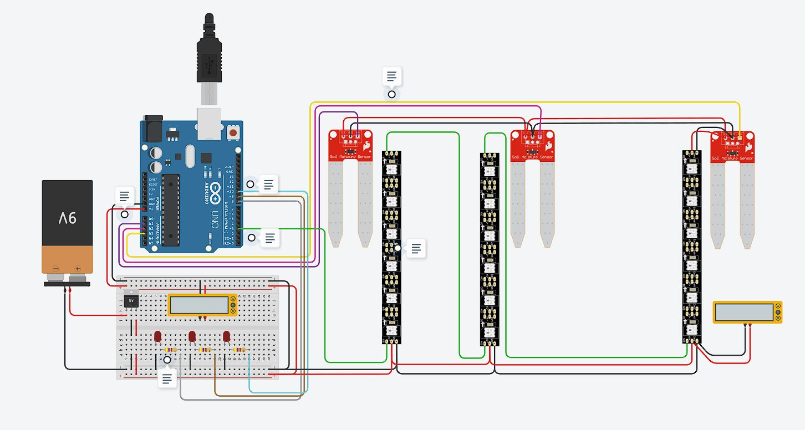

# Notes
> [!NOTE]
> System.
>[!IMPORTANT]
>
>This is an IMPORTANT note.

# Arduino

# Sistema de Rega

#### Start [Link](https://www.w3schools.com/cpp/)

- ✅ [Começar por decarar as constantes dos sensores](#)
- ✅ [Em seguida Declarar um BAUD RATE para ver os sensores](#)
------------------------------------------------------------------------------------------------------------------------------------------------
- ✅ [Em seguida declarar um long para Sensores](#)
- ✅ [Dentro do loop, Criar um Serial.println, para aparecer no painel](#)
------------------------------------------------------------------------------------------------------------------------------------------------
- ✅ [Criar uma função tipo void para ler o sensor](#)
    - ✅ [Dentro do void mudar a variavel do Sensor para ser igual a analogRead(Nome do sensor)](#)
------------------------------------------------------------------------------------------------------------------------------------------------
- ✅ [Dentro do setup](#)
    - ✅ [Criar um Serial.begin para ver no painel o sensor e declar o pinMode para dizer que é um INPUT](#)
------------------------------------------------------------------------------------------------------------------------------------------------
- ✅ [Dentro do loop](#)
    - ✅ [Colocar um read Sensor](#)
------------------------------------------------------------------------------------------------------------------------------------------------

- ✅ 
- ✅ 
- ✅ 
- ✅ 
- ✅ 
- ✅ 

